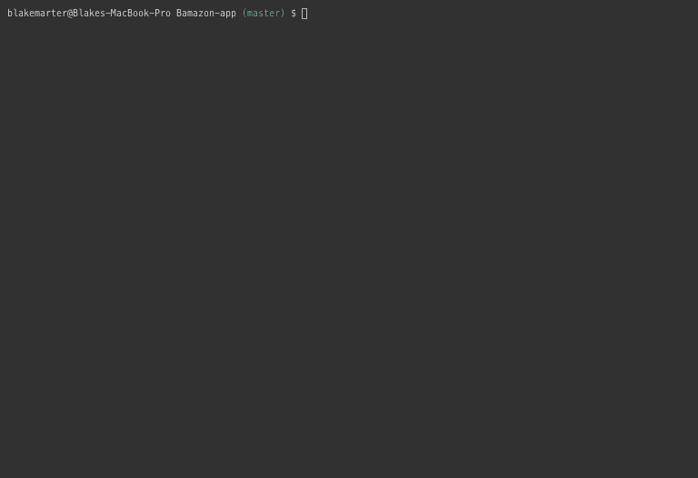
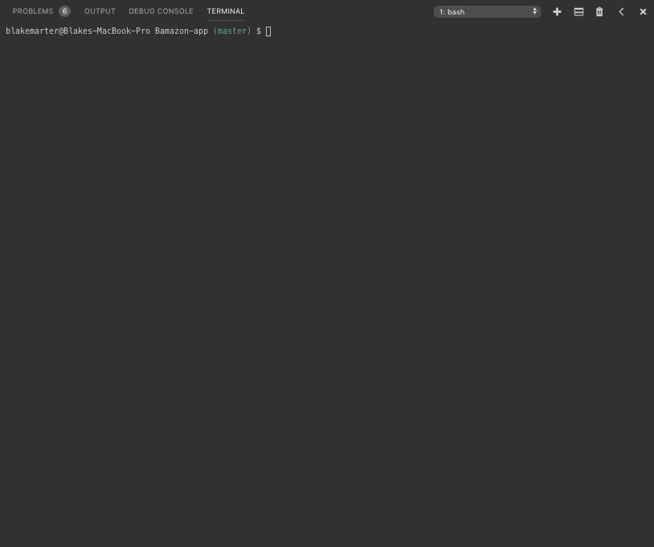

# __Welcome to Bamazon!__

## __Table of Contents__
* Overview
* Technologies
* Local Installation
* Demo
- - -
## __Overview__
  What is Bamazon? Bamazon is an amazing place where you can come and buy anything your heart desires (relatively speaking)! This Bamazon app is a command line node app that takes lets you interact with and manipulate data on a MySQL database.
  
  Cammands allowed by The Bamazon App:

  - `node bamazonCustomer.js`
    
    This will show you our entire list of items for purchase, here at Bamazon. You will then be prompted with 2 questions:
     * First question: `What is the ID of the product you'd like to buy?`
     * Second question: `How many of this product would you like to purchase?`
     
    Answering these two questions grabs the item you would like to buy, how many of that item you'd like to buy, and gives you a total amount you owe for those items. After this, it will prompt you with a confirm:
     * `Would you like to make another purchase?`

        If you select `y` or `yes`, it will reprompt you with the first and second questions.

        If you select `n` or `no`, it will thank you for your patronage and end the Bamazon app. 

  - `node bamazonManager.js`

     This will first prompt you (the manager) with a question (`What would you like to do, Mr. Manager?`) which has a list of actions that you may choose from:
     * `View Products for Sale`
       
       This shows you an organized table of all items we have at Bamazon.

     * `View Low Inventory`

       This shows you all items in our inventory that has 5 items or less in it's stock_quantity. If there are no low inventory items, the table will be blank.

     * `Add to Inventory`

       This will first show you an organized table of all items in the Bamazon inventory, then it will prompt you with 2 questions:
        
        - `What is the ID of the product you'd like to add to?`
        - `How many of this product would you like to add?`

        Answering these 2 questions will add whatever amount of items you'd like to whichever item you chose, and give you an updated table of all items in the inventory, including your additions. After this, it will prompt you with a confirm:

         * `Would you like to make another purchase?`

            If you select `y` or `yes`, it will reprompt you with the questions again.

            If you select `n` or `no`, it will give you an updated table of the changes made to the inventory and prompt you with the beginning list of questions.

     * `Add New Product`

        This will first prompt you with 4 questions:
        
        - `What is the name of the product you'd like to add? (Required):`
        - `What is the department that this item is listed under? (Required):`
        - `What is the price of this item? (Required):`
        - `How many of this item would you like add? (Required):`

        Answering these 4 questions will add whatever item you'd like to the inventory table, and give you an updated table of all items in the inventory, including your additions. After this, it will prompt you with a confirm:

         * `Would you like to make another purchase?`

            If you select `y` or `yes`, it will reprompt you with the questions again.

            If you select `n` or `no`, it will give you an updated table of the changes made to the inventory and prompt you with the beginning list of questions.


     * `Leave`

       This will end the Bamazon app. :(
- - -

## __Technologies__
* JavaScript
* MySQL
  * #### __MySQL Database requirements__
    These are provided within the `bamazon_db.sql` file, or you could import the `items.csv` file into your MySQL workbench.
    ```
    drop database if exists bamazon_db;
    create database bamazon_db;

    use bamazon_db;

    create table products (
      id int not null auto_increment,
      product_name varchar(100) not null,
      department_name varchar(30) null,
      price decimal(10,2) not null,
      stock_quantity int(11) not null,
      primary key (id)
    );

    use bamazon_db;

    insert into products (product_name, department_name, price, stock_quantity)
    values ("Echo Dot Smart Speaker", "Electronics", 29.99, 50);

    insert into products (product_name, department_name, price, stock_quantity)
    values ("Amazon Fire TV Stick", "Electronics", 49.99, 50);

    insert into products (product_name, department_name, price, stock_quantity)
    values ("Monopoly: Game of Thrones Edition", "Toys and Games", 23.49, 50);

    insert into products (product_name, department_name, price, stock_quantity)
    values ("Cards Against Humanity", "Toys and Games", 25.99, 50);

    insert into products (product_name, department_name, price, stock_quantity)
    values ("Mens Under Armour T-shirt", "Clothing", 18.99, 50);

    insert into products (product_name, department_name, price, stock_quantity)
    values ("Womens Under Armour T-shirt", "Clothing", 19.99, 50);

    insert into products (product_name, department_name, price, stock_quantity)
    values ("Lord of the Rings Triligy (hardcover) book set ", "Books", 37.58, 50);

    insert into products (product_name, department_name, price, stock_quantity)
    values ("Lord of the Rings Triligy (Soft Cover) book set ", "Books", 28.58, 50);

    insert into products (product_name, department_name, price, stock_quantity)
    values ("Game of Thrones (A Song of Ice and Fire) book set", "Books", 29.97, 50);

    insert into products (product_name, department_name, price, stock_quantity)
    values ("Microfiber Cleaning Cloth (24-pack)", "Automotive", 11.27, 50);

    select * from products;
    ```
    
* Node.js
  * #### __NPM Requirements__
    - mysql
    - inquirer
    - console.table
    - colors
     ```
     var mysql = require("mysql");
     var inquirer = require("inquirer");
     var cTable = require("console.table");
     var colors = require("colors");
     ```
- - - 
## __Local Installation__
* #### __Step 1: Git Clone__
    Because this is a CLI, it does not have a URL and cannot be viewed in the browser. You will need to clone the Bamazon app to your local computer by opening your terminal, navigating to the folder you want to store it in and input:
    ```
    git clone https://github.com/BlakeMarter/Bamazon-app.git
    ```
    The Bamazon app and its files should now be in your project folder.


 * #### __Step 2: Install Reaquired NPM's__
  
   Navigate to the correct JS file in your terminal and (because this app includes a `package.json`)     input `npm install` or `npm i`.
- - -
## __Demo__

Once you have everything installed, typing the following commands will give you suprising results!
 ### __Bamazon Customer__

  - Example input `node bamazonCustomer.js`

    


 ### __Bamazon Manager__

  Example input `node bamazonManager.js`

  - Example question `View Products for Sale`

    

  - Example input `View Low Inventory` (with low inventory items)

    

  - Example input `View Low Inventory` (without any low inventory items)  

    

  - Example input `Add to Inventory`

    

  - Example input `Add New Product`  

    

